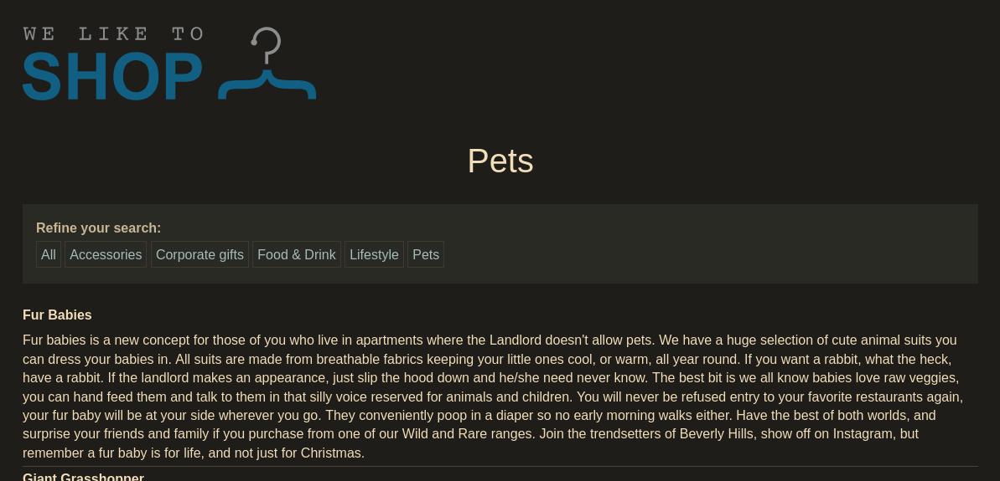
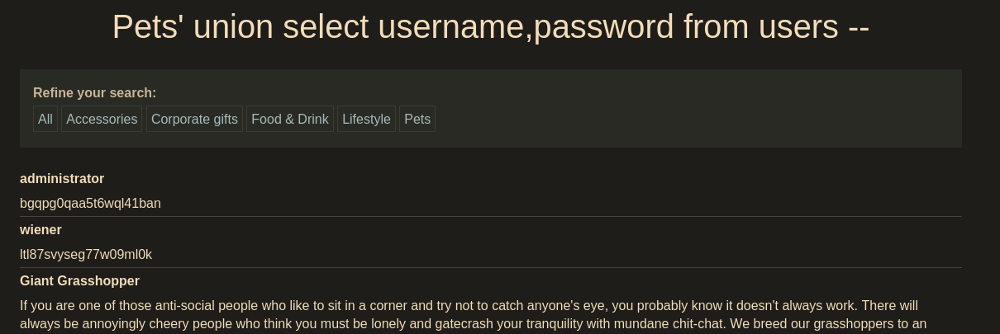

Clicking one of the categories and and appending `'` character to the url will cause a server error and will confirm that there's indeed an SQLi.

So we need to determine the number of columns like this. Our payloads will be concated to the url

```
' UNION SELECT NULL--
' UNION SELECT NULL,NULL--    <- will work
```

Given in the lab description we can then query the users table with suitable column names which is `username` and `password`

```
' UNION SELECT username,password FROM users --
```



After we log in to the admin account, lab will be completed.
