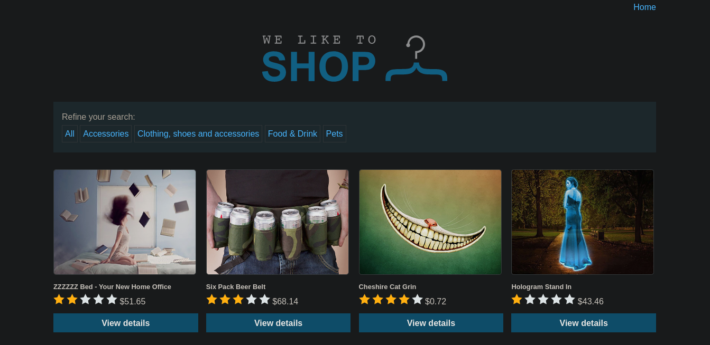

By looking at the home page we can see 2 clickable things avaliable right away:
- categories
- products 

Cliking on a random product opens a new tab.

`https://<unique_string>.web-security-academy.net/product?productId=15` 

Putting apostrophe or quote character will result in a string (`"Invalid product ID"`) getting displayed. So without tempering with it further, I'm trying the other clickable thing: categories.

Lab description gives the underlying query so it's rather straightforward 😃

<br>

*Query from lab description*
```
SELECT * FROM products WHERE category = 'Gifts' AND released = 1 
```

<br>

Click any category (mind that categories are random.)

```
https://<unique_string>.web-security-academy.net/filter?category=Pets
```

<br>

Putting apostrophe will cause `internal server error`.
And by bypassing `WHERE` clause, we can solve the lab.

```
https://<unique_string>.web-security-academy.net/filter?category=Pets' or 1=1 --
```

- `or 1=1` will neutralize `WHERE` clause, causing it to select all items
- by putting the comment-start (`--`) we discard stray `'` character and `released=1` condition
