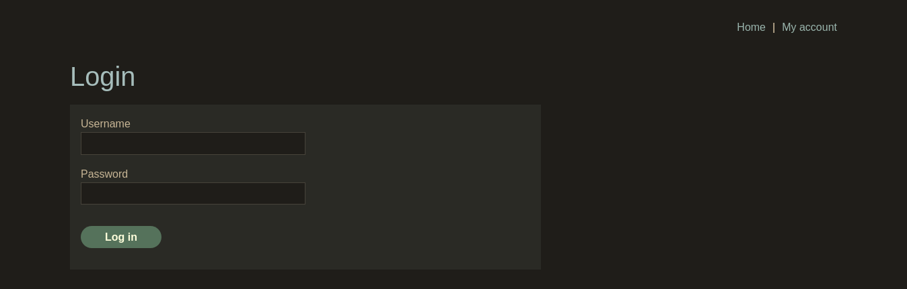

We know from the lab description that login page is vulnerable to sqli. 

To confirm that I'm putting `'` character in username section.

And we get `Internal Server Error`

By typing the username we want to log in and closing the vulnerable query with `'`, we can utilize this vulnerability. You can put anything you like for password. It will be commented out 

```
admin' --
```

Trying couple of usernames with the format above. We can find that the username is `adminstrator`.


